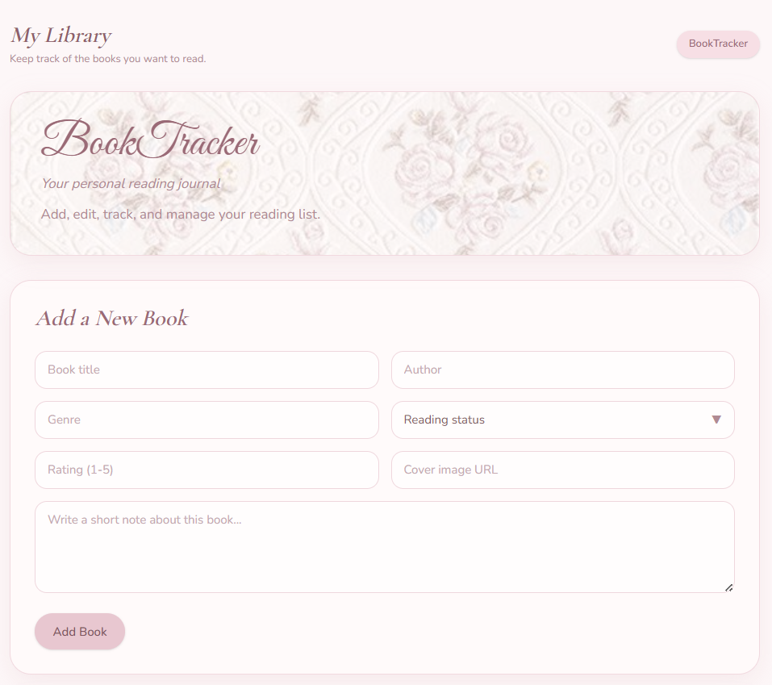
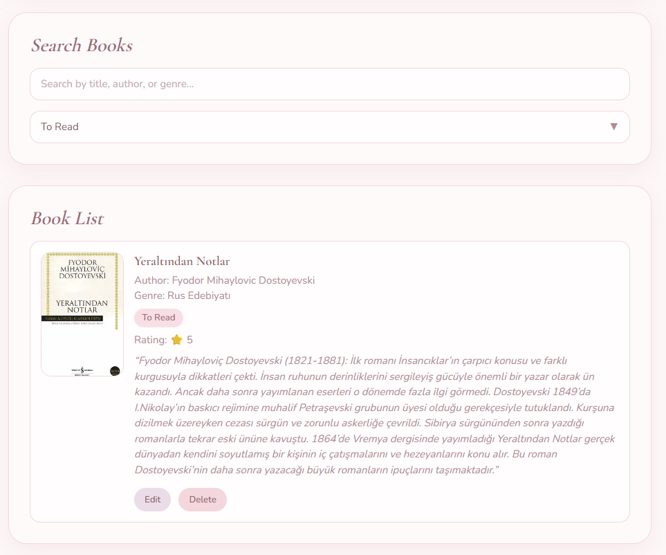
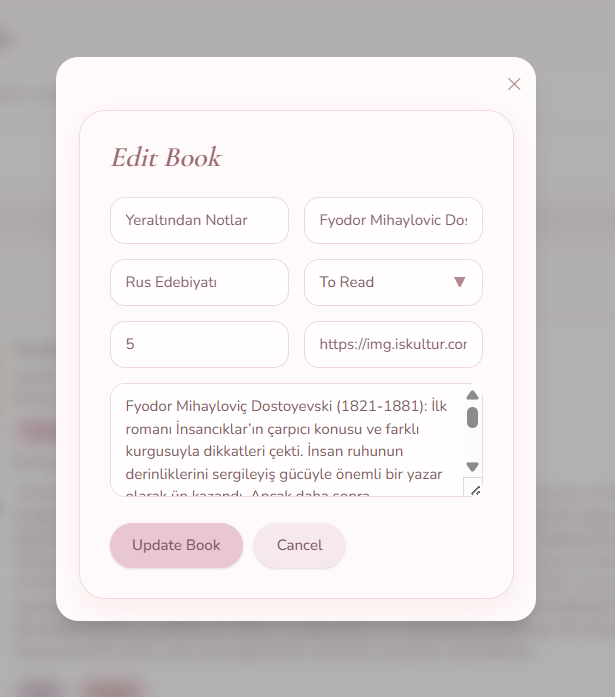
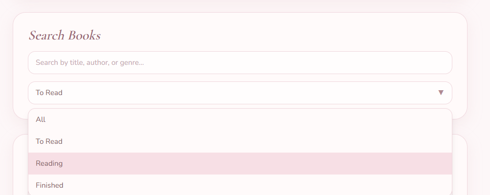

<p align="center">
  
</p>

<h1 align="center">📚 BookTracker App</h1>

<p align="center">
  <em>Your personal reading journal — beautifully crafted with React & Tailwind CSS</em>
</p>

<p align="center">
  
  
  
  
</p>

---

## ✨ Features

| Feature | Description |
|---------|-------------|
| 📖 **Add Books** | Add books with title, author, genre, status, rating, cover image URL, and personal notes |
| ✏️ **Edit Books** | Edit any book via a sleek modal overlay with pre-filled form data |
| 🗑️ **Delete Books** | Remove books from your library with a single click |
| 🔍 **Search** | Instantly search books by title, author, or genre |
| 🏷️ **Filter by Status** | Filter your library by reading status — *To Read*, *Reading*, or *Finished* |
| ✅ **Form Validation** | Real-time validation with inline error messages for required fields |
| 💾 **Local Storage** | All book data persists in the browser — no backend needed |
| 🖼️ **Cover Images** | Display book cover images via URL with a graceful placeholder fallback |
| 🎨 **Custom Dropdowns** | Beautifully styled custom select dropdowns with click-outside-to-close |
| 📱 **Fully Responsive** | Optimized layout for mobile, tablet, and desktop screens |

---

## 🖼️ Screenshots

### 📖 Ana Sayfa & Kitap Ekleme Formu


### 📚 Kitap Listesi & Arama


### ✏️ Kitap Düzenleme Modalı


### 🔽 Durum Filtresi (Custom Dropdown)


---

## 🛠️ Tech Stack

| Technology | Purpose |
|------------|---------|
| [React 19](https://react.dev/) | UI library with hooks (`useState`, `useEffect`, `useRef`) |
| [Tailwind CSS 4](https://tailwindcss.com/) | Utility-first CSS framework |
| [Vite 8](https://vite.dev/) | Lightning-fast dev server & build tool |
| [PostCSS](https://postcss.org/) + [Autoprefixer](https://github.com/postcss/autoprefixer) | CSS processing pipeline |
| [ESLint](https://eslint.org/) | Code quality & linting |
| [localStorage](https://developer.mozilla.org/en-US/docs/Web/API/Window/localStorage) | Client-side data persistence |

---

## 📁 Project Structure

```
frontend/
├── public/                     # Static assets
├── src/
│   ├── assets/                 # Images (background.jpg, swan.jpg)
│   ├── components/
│   │   ├── BookForm.jsx        # Add/Edit book form with validation
│   │   ├── EditModal.jsx       # Modal overlay for editing books
│   │   └── Navbar.jsx          # Top navigation bar
│   ├── pages/
│   │   └── Home.jsx            # Main page — search, filter, book list, CRUD logic
│   ├── interfaces/             # Data model definitions (Book.js)
│   ├── services/               # (Reserved for API services)
│   ├── App.jsx                 # Root component
│   ├── App.css                 # App-level styles
│   ├── main.jsx                # Entry point
│   └── index.css               # Tailwind imports & global typography
├── index.html                  # HTML template
├── vite.config.js              # Vite configuration
├── postcss.config.cjs          # PostCSS + Tailwind CSS setup
├── eslint.config.js            # ESLint configuration
├── package.json                # Dependencies & scripts
└── README.md
```

---

## 🚀 Getting Started

### Prerequisites

- **Node.js** ≥ 18.x
- **npm** ≥ 9.x

### Installation

```bash
# 1. Clone the repository
git clone https://github.com/merve-dasci/booktracker-app.git
cd booktracker-app/frontend

# 2. Install dependencies
npm install

# 3. Start the development server
npm run dev
```

The app will be available at **http://localhost:5173** (or the next available port).

### Build for Production

```bash
# Create an optimized production build
npm run build

# Preview the production build locally
npm run preview
```

---

## 📜 Available Scripts

| Script | Command | Description |
|--------|---------|-------------|
| `dev` | `npm run dev` | Start Vite dev server with HMR |
| `build` | `npm run build` | Create optimized production build |
| `preview` | `npm run preview` | Preview production build locally |
| `lint` | `npm run lint` | Run ESLint to check code quality |

---

## 🎨 Design System

The app follows a **soft pink & rose** aesthetic with carefully chosen colors:

| Element | Color | Hex |
|---------|-------|-----|
| Primary Text | Rose Brown | `#9a6a76` |
| Secondary Text | Muted Rose | `#b08a93` |
| Background | Snow White | `#fffafa` |
| Page Background | Soft Blush | `#fdf7f8` |
| Borders | Light Pink | `#f1d9df` |
| Buttons | Pastel Rose | `#e8c7d0` |
| Status: Finished | Soft Green | `#e7f6ea` |
| Status: Reading | Warm Gold | `#fdf1d8` |
| Status: To Read | Light Rose | `#f8dfe6` |

**Typography:**
- Body text: [Nunito](https://fonts.google.com/specimen/Nunito) (sans-serif)
- Headings: [Cormorant Garamond](https://fonts.google.com/specimen/Cormorant+Garamond) (serif)
- App title: [Great Vibes](https://fonts.google.com/specimen/Great+Vibes) (cursive)

---

## 🧩 Component Overview

### `Home.jsx` — Main Page
The central hub that manages all state and CRUD operations:
- Book list with cover images, status badges, and hover animations
- Search bar with real-time text filtering
- Custom dropdown for status filtering
- Click-outside-to-close behavior via `useRef`
- localStorage sync via `useEffect`

### `BookForm.jsx` — Add / Edit Form
A reusable form component with:
- Two-column responsive grid layout
- Custom styled dropdown for reading status
- Inline validation errors (title, author, status, rating)
- Conditional rendering for Add vs Edit mode
- Cancel button during edit mode

### `EditModal.jsx` — Modal Overlay
A minimal, reusable modal with:
- Backdrop blur + dark overlay
- Close button (✕)
- Renders any children passed to it

### `Navbar.jsx` — Navigation Bar
A clean header with app branding and subtitle.

---

## 🗺️ Roadmap

- [ ] 🌐 Backend API integration (Node.js / Express)
- [ ] 🔐 User authentication & personal libraries
- [ ] 📊 Reading statistics dashboard
- [ ] 🏷️ Tags and categories
- [ ] 📤 Export / Import book lists (JSON, CSV)
- [ ] 🌙 Dark mode toggle
- [ ] 📱 PWA support for offline access

---

## 🤝 Contributing

Contributions are welcome! Feel free to:

1. Fork the project
2. Create a feature branch (`git checkout -b feature/amazing-feature`)
3. Commit your changes (`git commit -m 'Add amazing feature'`)
4. Push to the branch (`git push origin feature/amazing-feature`)
5. Open a Pull Request

---

## 📄 License

This project is licensed under the **MIT License** — see the [LICENSE](LICENSE) file for details.

---

<p align="center">
  Made with ❤️ and ☕ by <strong>Betül</strong>
</p>
